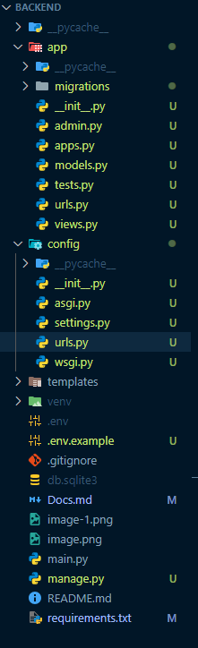

# Relatório de Documentação do Projeto: Sistema de Gerenciamento de Finanças Pessoais - Personal Finance

## Introdução

Este relatório documenta o planejamento e as decisões técnicas para o desenvolvimento de um Produto Mínimo Viável (MVP) de um sistema de gerenciamento de finanças pessoais. O objetivo é fornecer uma visão clara das funcionalidades essenciais, considerações técnicas, medidas de segurança e próximos passos para o projeto.

## Visão Geral do Projeto

O sistema de gerenciamento de finanças pessoais visa ajudar os usuários a rastrear suas despesas, gerenciar orçamentos e visualizar relatórios financeiros de forma simples e segura. O MVP focará em funcionalidades básicas para validar a ideia e coletar feedback inicial dos usuários.

## Funcionalidades do MVP

As seguintes funcionalidades são essenciais para o MVP:

- **Registro e Autenticação**: Cadastro com e-mail e senha, com autenticação de múltiplos fatores opcional.
- **Rastreamento de Despesas**: Registro manual de despesas com categorização.
- **Rastreamento de Investimentos**: Registro manual de investimentos.
- **Rastreamento de Renda**: Registro manual de renda com categorização.
- **Gerenciamento de Orçamento**: Definir limites de gastos por categoria e receber alertas.
- **Relatórios Simples**: Dashboards com gráficos de renda, despesas e status do orçamento.
- **Segurança e Privacidade**: Criptografia com Argon2id de dados e autenticação segura.
- **Design Responsivo**: Interface funcional em dispositivos móveis e desktops.
- **Alertas e Notificações (Opcional)**: Notificações para limites de orçamento ou contas a pagar.

## Considerações Técnicas

Para o desenvolvimento do MVP, sugerimos as seguintes tecnologias:

- **Modelo de Pastas**: 
- **Frontend**: React ou Vue.js para interfaces dinâmicas e responsivas.
- **Backend**: Node.js com Express ou Django para APIs RESTful.
- **Testes Automatizado**: <a href="https://12factor.net/pt_br/">Realizar o projeto seguindo os 12 fatores.<a/>
- **Banco de Dados**: PostgreSQL ou MongoDB para armazenamento seguro.
    - **Modelo Conceitual**: 
- **Segurança**: Bibliotecas como bcrypt para senhas e JWT para autenticação.
- **Hospedagem**: AWS, Heroku ou Firebase para escalabilidade inicial.

Essas tecnologias foram escolhidas por sua robustez, comunidade ativa e adequação às necessidades de segurança e escalabilidade do projeto.

## Segurança e Privacidade

A segurança é uma prioridade crítica. As seguintes medidas serão implementadas:

- Criptografia de dados em trânsito e em repouso (ex.: AES-256).
- Autenticação segura com hash de senhas (ex.: argon2id).
- Conformidade com regulamentações como GDPR e padrões como ISO 27001.
- Auditorias de segurança regulares.

A conformidade com regulamentações de privacidade é essencial para proteger os dados dos usuários e manter a confiança no sistema.

## Desafios e Soluções

Alguns desafios potenciais incluem:

- **Adoção de Usuários**: Oferecer um período gratuito ou incentivos para primeiros usuários e um onboarding bem projetado.
- **Precisão dos Dados**: Simplificar a entrada de dados com formulários intuitivos e sugestões automáticas.
- **Complexidade de Integrações**: Evitar integrações com bancos no MVP, focando em entrada manual.
- **Manutenção da Segurança**: Realizar auditorias regulares e manter bibliotecas atualizadas.

## Próximos Passos

Após a conclusão do MVP, os próximos passos incluem:

1. **Testes com Usuários**: Coletar feedback de um grupo limitado de usuários.
2. **Análise de Feedback**: Identificar áreas de melhoria e novas funcionalidades.
3. **Iteração**: Planejar a próxima versão com base no feedback, possivelmente adicionando integração bancária ou análises avançadas.

## Conclusão

O MVP proposto oferece uma base sólida para o sistema de gerenciamento de finanças pessoais, focando em funcionalidades essenciais, segurança e usabilidade. Este relatório serve como um guia para o desenvolvimento e pode ser ajustado conforme o projeto evolui.